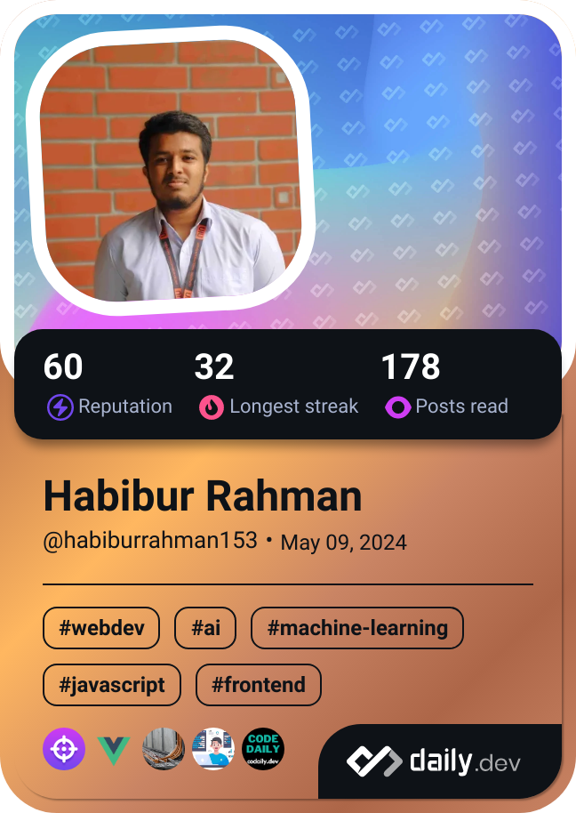

<!-- Add this section for GitHub Workflow Badges -->
<p align="center">
  <a href="https://github.com/habib-153/habib-153/actions/workflows/devcard.yml">
    
  </a>
  
</p>

---

## 🙋‍♂️ About Me

<div>
<a href="https://app.daily.dev/habiburrahman153"></a>

```javascript
const habibur = {
  pronouns: "He" | "Him",
  location: "Bangladesh 🇧🇩",
  education: "Data Science @ UIU",
  roles: ["Full Stack Developer", "Data Science Enthusiast"],
  currentFocus: "Building data-driven web applications",
  funFact: "I debug with console.log() and I'm proud of it! 😄",
};
```

- 🚀 Full-stack developer working with **React, Next.js, Express, MongoDB, PostgreSQL**
- 📊 Diving deep into **Data Science & Machine Learning** with Python ecosystem
- 🎓 Currently studying **Data Science** at UIU
- 💡 Building projects that combine web development with data visualization
- 🤔 Actively seeking **Internship/Job opportunities** in Full-stack or Data Science roles
- 🎯 Focused on problem-solving, algorithms, and building data-driven applications

</div>

---

## 📫 Connect With Me

<p align="center">
  <a href="https://www.facebook.com/h.R4hM4n.8" target="_blank">
    
  </a>
  <a href="https://www.linkedin.com/in/habiburrahman153" target="_blank">
    
  </a>
  <a href="mailto:h.r.sihab155@gmail.com">
    
  </a>
</p>

---

## 💻 Tech Stack

### 🎨 Frontend Development

<p align="center">
  
</p>

### ⚙️ Backend Development

<p align="center">
  
</p>

### 🗄️ Databases & Cloud

<p align="center">
  
</p>

### 📊 Data Science & Machine Learning

<p align="center">
  
  
  
  
  
  
  
</p>

### 🛠️ Tools & Platforms

<p align="center">
  
  <br/>
  
  
  
  
</p>

---

## 📈 GitHub Stats

<p align="center">
  <a href="https://git.io/streak-stats">
    
  </a>
</p>

<p align="center">
  
  
</p>

<p align="center">
  
</p>

<!-- Activity Graph -->
<p align="center">
  
</p>
---

<!-- Snake Animation -->
<div align="center">
  
</div>

---

<div align="center">
  
</div>

---

<p align="center">
  <b>💡 "Code is like humor. When you have to explain it, it's bad." – Cory House</b>
</p>

<!-- [](https://visitcount.itsvg.in) -->
